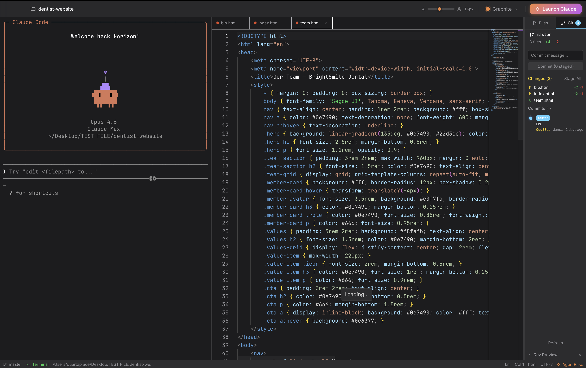

<p align="center">
  
</p>

<h1 align="center">Clif</h1>

<p align="center">
  <strong>~20MB. Native. AI-native. Your code never leaves your machine.</strong>
</p>

<p align="center">
  <a href="LICENSE"></a>
  <a href="https://github.com/DLhugly/Clif/releases"></a>
  
  
  
  
</p>

<p align="center">
  <a href="#install">Install</a> &middot;
  <a href="#features">Features</a> &middot;
  <a href="#architecture">Architecture</a> &middot;
  <a href="#development">Development</a>
</p>

---

Cursor is 400MB. VS Code is 350MB. Zed doesn't do AI.

**Clif is ~20MB.** A native Rust binary with a 7KB SolidJS frontend. VS Code-quality editing via Monaco. Real terminal via PTY. Git built into the backend. AI when you want it, silence when you don't.

No Electron. No telemetry. No subscription. Open source.

## Download v1.2.0

<p align="center">
  <a href="https://github.com/DLhugly/Clif/releases/download/v1.2.0/Clif_1.2.0_aarch64.dmg"></a>
  &nbsp;
  <a href="https://github.com/DLhugly/Clif/releases/download/v1.2.0/Clif_1.2.0_x64.dmg"></a>
</p>

> [All releases & checksums](https://github.com/DLhugly/Clif/releases) &middot; Windows & Linux coming soon

**From source** —
```bash
git clone https://github.com/DLhugly/Clif.git && cd Clif
npm install && npm run tauri dev
```

## Features

**Monaco Editor** — 70+ languages, IntelliSense, multi-cursor, minimap, code folding. The same engine as VS Code.

**Real Terminal** — Native PTY via Rust. Your actual shell with 256-color, resize, 10K scrollback. Not a simulation.

**Dev Preview** — One-click `npm run dev`, auto-detects `localhost` URLs, live iframe preview. Run and see your app without switching windows.

**Git** — Branch, status, stage, commit, per-file `+/-` diff stats, visual commit graph. All Rust, no shelling out.

**AI** — OpenRouter (Claude, GPT-4, Gemini, 100+ models), Ollama (fully local), Claude Code CLI. All opt-in. Works fine offline with zero keys.

**5 Themes** — Midnight, Graphite, Dawn, Arctic, Dusk. Editor, terminal, and UI stay in sync.

**Keys** — `Ctrl+`` ` terminal, `Ctrl+B` sidebar, `Ctrl+S` save, `Ctrl+Shift+P` palette.

## The Size Flex

| | Binary | Runtime | RAM idle |
|---|--------|---------|----------|
| **Clif** | **~20MB** | **7KB** | **~80MB** |
| Cursor | ~400MB | ~50MB | ~500MB+ |
| VS Code | ~350MB | ~40MB | ~400MB+ |
| Zed | ~100MB | native | ~200MB |

Tauri 2 compiles to a single native binary. SolidJS has no virtual DOM overhead. Rust handles all heavy lifting — file I/O, git, PTY, AI streaming — with zero garbage collection.

## Architecture

```
┌─────────────────────────────────────────┐
│             Tauri 2 (Rust)              │
│  File I/O · Git · PTY · AI · Search    │
│                  │                      │
│            IPC (invoke/events)          │
│                  │                      │
│           SolidJS + TypeScript          │
│       Monaco Editor · xterm.js          │
│           Tailwind CSS 4                │
└─────────────────────────────────────────┘
```

| Layer | Tech | Size |
|-------|------|------|
| Backend | Tauri 2 + Rust | ~20MB compiled |
| UI | SolidJS | 7KB runtime |
| Editor | Monaco | tree-shaken |
| Terminal | xterm.js + portable-pty | real PTY |
| Styles | Tailwind CSS 4 | zero runtime |
| Build | Vite 6 | <5s HMR |
| CI/CD | Semantic Release | auto-versioned |

## Development

```bash
npm install              # deps
npm run tauri dev        # dev mode + hot reload
npm run tauri build      # production binary
cd src-tauri && cargo check  # check rust
```

```
src/                     # SolidJS frontend
├── components/          # editor, terminal, layout, explorer
├── stores/              # reactive state (signals + stores)
├── lib/                 # IPC wrappers, keybindings, themes
└── types/               # TypeScript interfaces

src-tauri/src/           # Rust backend
├── commands/            # fs, git, pty, ai, search, settings
└── services/            # file watcher, ai providers
```

[Conventional commits](https://www.conventionalcommits.org/) — `feat:` bumps minor, `fix:` bumps patch, `feat!:` bumps major. Semantic release handles the rest.

## License

[MIT](LICENSE)

---

<p align="center"><strong>20MB. Native. Private. Fast.</strong></p>
