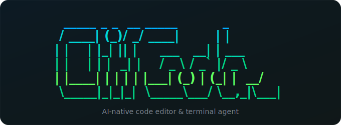

<p align="center">
  <picture>
    <source media="(prefers-color-scheme: dark)" srcset="logo.svg">
    <source media="(prefers-color-scheme: light)" srcset="logo.svg">
    
  </picture>
</p>

<p align="center">
  <strong>~20MB desktop IDE. Terminal AI agent. Both native. Both open source.</strong>
</p>

<p align="center">
  <a href="LICENSE"></a>
  <a href="https://github.com/DLhugly/Clif-Code/releases"></a>
  <a href="https://www.npmjs.com/package/clifcode"></a>
  
  
  
  
</p>

<p align="center">
  <a href="https://clifcode.io">Website</a> &nbsp;&middot;&nbsp;
  <a href="#-get-it">Get It</a> &nbsp;&middot;&nbsp;
  <a href="#-clifpad">ClifPad</a> &nbsp;&middot;&nbsp;
  <a href="#-clifcode">ClifCode</a> &nbsp;&middot;&nbsp;
  <a href="#-build--contribute">Development</a> &nbsp;&middot;&nbsp;
  <a href="https://github.com/DLhugly/Clif-Code/releases">Releases</a>
</p>

---

Cursor is 400MB. VS Code is 350MB. Zed doesn't do AI.

**Clif is ~20MB.** A native Rust binary with a 7KB SolidJS frontend. VS Code-quality editing via Monaco. Real terminal via PTY. Git built into the backend. AI when you want it, silence when you don't.

No Electron. No telemetry. No subscription. Open source.

<p align="center">
  
</p>

---

## 📦 Get It

<table>
<tr>
<td width="50%" valign="top">

### ClifPad — Desktop IDE

<p>
  <a href="https://github.com/DLhugly/Clif-Code/releases/download/v1.4.0/ClifPad_1.4.0_aarch64.dmg"></a>
  <a href="https://github.com/DLhugly/Clif-Code/releases/download/v1.4.0/ClifPad_1.4.0_x64.dmg"></a>
</p>
<p>
  <a href="https://github.com/DLhugly/Clif-Code/releases/download/v1.4.0/ClifPad_1.4.0_x64-setup.exe"></a>
  <a href="https://github.com/DLhugly/Clif-Code/releases/download/v1.4.0/ClifPad_1.4.0_amd64.deb"></a>
  <a href="https://github.com/DLhugly/Clif-Code/releases/download/v1.4.0/ClifPad_1.4.0_amd64.AppImage"></a>
</p>

> **macOS "App can't be opened"?** — Run `xattr -cr /Applications/ClifPad.app` then open normally. [Why?](#-faq)

</td>
<td width="50%" valign="top">

### ClifCode — Terminal Agent

```bash
cargo install clifcode
```

Run `clifcode` in any project directory. That's it.

> `npm i -g clifcode` — coming soon

<details>
<summary>Other install methods</summary>

```bash
# Or clone and build locally
git clone https://github.com/DLhugly/Clif-Code.git
cd Clif-Code/clif-code-tui && cargo install --path .
```

</details>

</td>
</tr>
</table>

> [All releases & checksums](https://github.com/DLhugly/Clif-Code/releases)

---

## 🖥️ ClifPad

**📝 Monaco Editor** — 70+ languages, IntelliSense, multi-cursor, minimap, code folding. Same engine as VS Code.

**🖥️ Real Terminal** — Native PTY via Rust. Your actual shell with 256-color, resize, 10K scrollback.

**🔍 Dev Preview** — One-click `npm run dev`, auto-detects `localhost`, live iframe preview.

**🌿 Git** — Branch, status, stage, commit, per-file `+/-` diff stats, visual commit graph. All Rust.

**🤖 AI** — OpenRouter (100+ models), Ollama (fully local), Claude Code CLI. Ghost text completions. All opt-in.

**🎨 5 Themes** — Midnight, Graphite, Dawn, Arctic, Dusk. Editor, terminal, and UI stay in sync.

**⌨️ Keys** — `Ctrl+`` ` terminal, `Ctrl+B` sidebar, `Ctrl+S` save, `Ctrl+Shift+P` palette.

### 📊 The Size Flex

| | Binary | Runtime | RAM idle |
|---|--------|---------|----------|
| **ClifPad** | **~20MB** | **7KB** | **~80MB** |
| Cursor | ~400MB | ~50MB | ~500MB+ |
| VS Code | ~350MB | ~40MB | ~400MB+ |
| Zed | ~100MB | native | ~200MB |

Tauri 2 compiles to a single native binary. SolidJS has no virtual DOM overhead. Rust handles file I/O, git, PTY, AI streaming — zero garbage collection.

---

## ⚡ ClifCode

> **Open-source AI coding agent for your terminal. Like Claude Code — but you own it.**

```
   _____ _ _  __ _____          _
  / ____| (_)/ _/ ____|        | |
 | |    | |_| || |     ___   __| | ___
 | |    | | |  _| |    / _ \ / _` |/ _ \
 | |____| | | | | |___| (_) | (_| |  __/
  \_____|_|_|_|  \_____\___/ \__,_|\___|

  AI coding assistant — works anywhere, ships fast

  ◆ Model  anthropic/claude-sonnet-4    ◆ Mode  auto-edit
  ◆ Path   ~/projects/my-app

  Type a task to get started, or /help for commands
  ─────────────────────────────────────────────

  ❯ refactor the auth module to use JWT tokens

  [1/7] ••• thinking
    ▶ read  src/auth/mod.rs
    ▶ read  src/auth/session.rs
    ◇ find  config.toml
    ✎ edit  src/auth/mod.rs  +42 -18
    ✎ edit  src/auth/session.rs  +15 -8
    ▸ run   cargo test
    ✓ All 23 tests passed

  ✦ ClifCode  Refactored auth module to use JWT tokens.
              Replaced session-based auth with stateless JWT
              verification. Added token expiry and refresh logic.

  ∙ 2.1k tokens  ∙ ~$0.0312
```

**What it does:** Tool-calling AI agent that reads your codebase, writes code, runs commands, searches files, and auto-commits — all from a TUI.

| | | |
|---|---|---|
| **Agentic loop** — up to 7 tool calls per turn | **Any provider** — OpenRouter, OpenAI, Anthropic, Ollama | **Parallel tools** — concurrent read-only calls |
| **3 autonomy modes** — suggest, auto-edit, full-auto | **Sessions** — auto-save, resume, cost tracking | **9 built-in tools** — read, write, edit, find, search, run, list, cd, submit |

```bash
clifcode                                        # interactive mode
clifcode -p "explain this codebase"             # non-interactive
clifcode --backend ollama                       # local models
clifcode --autonomy suggest                     # confirm every write
clifcode --resume                               # resume last session
```

<details>
<summary><strong>Commands & providers</strong></summary>

```
  ◆ Session     /new  /sessions  /resume  /cost  /clear  /quit
  ◆ Workspace   /cd   /add       /drop    /context
  ◆ Settings    /mode /backend   /config
  ◆ Git         /status  /undo
```

| Provider | Config |
|----------|--------|
| **OpenRouter** (default) | `CLIFCODE_API_KEY` — access to 100+ models |
| **OpenAI** | `--api-url https://api.openai.com/v1` |
| **Anthropic** | Via OpenRouter or compatible proxy |
| **Ollama** | `--backend ollama` — fully local, no API key |
| **Any OpenAI-compatible** | `--api-url <your-endpoint>` |

</details>

---

## 🛠️ Build & Contribute

```bash
# ClifPad — desktop IDE
cd clif-pad-ide
npm install && npm run tauri dev        # dev mode + hot reload
npm run tauri build                     # production binary

# ClifCode — terminal agent
cd clif-code-tui
cargo run --release                     # run directly
cargo install --path .                  # install to PATH
```

### Architecture

```
┌─────────────────────────────────────────┐
│             Tauri 2 (Rust)              │
│  File I/O · Git · PTY · AI · Search    │
│                  │                      │
│            IPC (invoke/events)          │
│                  │                      │
│           SolidJS + TypeScript          │
│       Monaco Editor · xterm.js          │
│           Tailwind CSS 4                │
└─────────────────────────────────────────┘
```

| Layer | Tech | Size |
|-------|------|------|
| Backend | Tauri 2 + Rust | ~20MB compiled |
| UI | SolidJS | 7KB runtime |
| Editor | Monaco | tree-shaken |
| Terminal | xterm.js + portable-pty | real PTY |
| Styles | Tailwind CSS 4 | zero runtime |
| Build | Vite 6 | <5s HMR |
| CI/CD | Semantic Release | auto-versioned |

### Project Structure

```
Clif-Code/
├── clif-pad-ide/    🖥️  Desktop IDE — Tauri 2 + SolidJS + Monaco
├── clif-code-tui/   ⚡  Terminal AI agent — pure Rust, any API
└── .github/         🔄  CI/CD (auto-release, npm publish)
```

```
clif-pad-ide/
├── src/                     # SolidJS frontend
│   ├── components/          # editor, terminal, layout, explorer
│   ├── stores/              # reactive state (signals + stores)
│   ├── lib/                 # IPC wrappers, keybindings, themes
│   └── types/               # TypeScript interfaces
├── src-tauri/src/           # Rust backend
│   ├── commands/            # fs, git, pty, ai, search, settings
│   └── services/            # file watcher, ai providers
└── www/                     # Landing page (clifcode.io)

clif-code-tui/
├── src/
│   ├── main.rs              # CLI, TUI loop, agent orchestration
│   ├── backend.rs           # API backend (OpenRouter, OpenAI, Ollama)
│   ├── tools.rs             # Tool definitions and execution
│   ├── ui.rs                # Terminal UI rendering
│   ├── session.rs           # Session persistence
│   ├── config.rs            # Config (API keys, provider setup)
│   ├── git.rs               # Git integration
│   └── repomap.rs           # Workspace structure analysis
├── npm/                     # npm distribution packages
│   ├── clifcode/            # Main wrapper (npm i -g clifcode)
│   └── @clifcode/cli-*/     # 6 platform-specific binaries
└── scripts/
    └── bump-version.js      # Syncs versions across Cargo.toml + npm
```

[Conventional commits](https://www.conventionalcommits.org/) — `feat:` bumps minor, `fix:` bumps patch, `feat!:` bumps major. Semantic release handles the rest.

---

## ❓ FAQ

**Why does macOS say "App can't be opened"?**
macOS Gatekeeper blocks apps that aren't signed with a $99/year Apple Developer certificate. ClifPad is open source and safe — run `xattr -cr /Applications/ClifPad.app` in Terminal to remove the quarantine flag, then open normally.

**Is Clif safe?**
100% open source. Read every line: [github.com/DLhugly/Clif-Code](https://github.com/DLhugly/Clif-Code). No telemetry, no network calls unless you enable AI. The `xattr` command just removes Apple's download flag — it doesn't disable any security.

**Why not just pay for code signing?**
We will. For now, the $99/year Apple Developer fee goes toward more important things. Proper signing + notarization is on the roadmap.

**Does it work offline?**
ClifPad: Yes — AI features are opt-in. Without API keys, it's a fully offline editor with terminal and git. ClifCode: Needs an API provider (but Ollama runs fully local with no internet).

**What models does ClifCode support?**
Any OpenAI-compatible API. Default is `anthropic/claude-sonnet-4` via OpenRouter. Also works with GPT-4o, Gemini, Llama, Qwen, Mistral, DeepSeek — anything on OpenRouter or Ollama.

---

## 📜 License

[MIT](LICENSE) — use it however you want.

<br>

<p align="center">
  <strong>20MB. Native. Private. Fast.</strong>
</p>

<p align="center">
  <sub>Built with Rust and care by <a href="https://github.com/DLhugly">DLhugly</a></sub>
</p>
