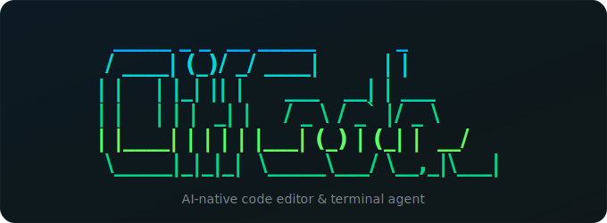
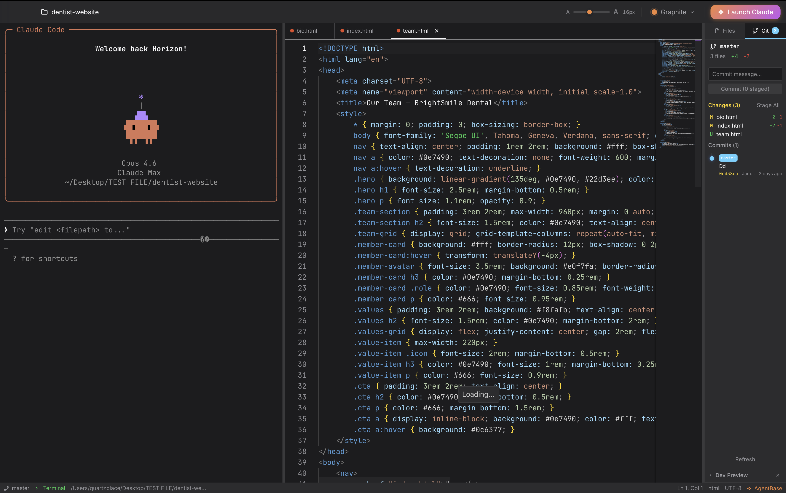

<p align="center">
  <picture>
    <source media="(prefers-color-scheme: dark)" srcset="logo.svg">
    <source media="(prefers-color-scheme: light)" srcset="logo.svg">
    
  </picture>
</p>

<p align="center">
  <strong>~20MB native code editor with built-in AI agents. Ships fast.</strong>
</p>

<p align="center">
  <a href="LICENSE"></a>
  <a href="https://github.com/DLhugly/Clif-Code/releases"></a>
  <a href="https://crates.io/crates/clifcode"></a>
  <a href="https://www.npmjs.com/package/clifcode"></a>
  <a href="https://github.com/DLhugly/Clif-Code/stargazers"></a>
  
</p>

<p align="center">
  <a href="https://clifcode.io">Website</a> ·
  <a href="#get-it">Download</a> ·
  <a href="#clifpad">ClifPad</a> ·
  <a href="#clifcode-tui">ClifCode TUI</a> ·
  <a href="#build">Development</a>
</p>

---

Two products, one monorepo:

1. **ClifPad** — Desktop IDE with Monaco editor, real terminal, git, and an AI agent sidebar
2. **ClifCode** — Terminal AI agent that reads, writes, searches, and runs commands

Both use any LLM via OpenRouter, OpenAI, Anthropic, or Ollama (fully local). No Electron. No telemetry. No subscription.

<p align="center">
  
</p>

---

## Get It

<table>
<tr>
<td width="50%" valign="top">

### ClifPad — Desktop IDE

Download from [Releases](https://github.com/DLhugly/Clif-Code/releases/latest) — macOS (.dmg), Windows (.exe), Linux (.deb, .AppImage).

Built-in auto-updater checks for new versions on startup.

> **macOS "App can't be opened"?** Run `xattr -cr /Applications/ClifPad.app` then open normally.

</td>
<td width="50%" valign="top">

### ClifCode — Terminal Agent

```bash
cargo install clifcode
```

```bash
npm i -g clifcode
```

Run `clifcode` in any project. Built-in `/update` command for self-updates.

</td>
</tr>
</table>

---

## ClifPad

A ~20MB native Rust IDE. Tauri 2 backend, SolidJS frontend, Monaco editor.

**Editor** — 70+ languages, IntelliSense, multi-cursor, minimap, code folding. Same engine as VS Code.

**Terminal** — Native PTY. Multiple tabs, kill, clear. Launch ClifCode or Claude Code with one click.

**Git** — Branch, stage, commit, push/pull, per-file diff stats, visual commit graph. All in Rust.

**AI Agent Sidebar** — Built-in chat agent with 9 tools (read, write, edit, search, find, list, run commands). Streams responses, shows tool calls with arguments inline, context compaction for long tasks. Separate from the terminal — both can run simultaneously.

**20 Themes** — Midnight, Graphite, Dawn, Arctic, Dusk, Cyberpunk, Ember, Forest, Solarized Dark, Monokai, Nord, Dracula, One Dark, Tokyo Night, Catppuccin, Rosé Pine, Ayu Dark, Vesper, Poimandres, Pale Fire. Two-column theme picker split by dark/light.

**Security Scanner** — Detects hardcoded secrets, API keys, private keys, SQL injection, eval/exec, and more. Runs automatically before every git commit — warns before you ship a vulnerability. Full repo scan from the status bar. Enable/disable toggle. No false positives from binary files or dependencies.

**Keyboard Shortcuts** — `Ctrl+`` ` toggle terminal, `Ctrl+Shift+`` ` new terminal, `Cmd+K` clear terminal, `Ctrl+B` sidebar, `Ctrl+S` save, `Ctrl+Shift+P` command palette.

### Size Comparison

| | Binary | RAM (idle) |
|---|---|---|
| **ClifPad** | **~20MB** | **~80MB** |
| Cursor | ~400MB | ~500MB+ |
| VS Code | ~350MB | ~400MB+ |
| Zed | ~100MB | ~200MB |

---

## ClifCode TUI

Terminal AI agent. Like Claude Code, but works with any LLM.

```
  ◆ Model  anthropic/claude-sonnet-4    ◆ Mode  auto-edit
  ◆ Path   ~/projects/my-app

  ❯ refactor the auth module to use JWT tokens

    ▶ read  src/auth/mod.rs
    ▶ read  src/auth/session.rs
    ✎ edit  src/auth/mod.rs  +42 -18
    ▸ run   cargo test — 23 tests passed

  ✦ ClifCode  Refactored auth to JWT. Added token expiry and refresh.
  ∙ 2.1k tokens  ∙ ~$0.0312
```

### Tools

| Tool | What it does |
|---|---|
| `read_file` | Read files with offset for large files |
| `write_file` | Create/overwrite files, shows diff |
| `edit_file` | String replacement with fuzzy fallback |
| `find_file` | Recursive name search |
| `search` | Grep across 15+ file types |
| `list_files` | Directory tree view |
| `run_command` | Shell execution with 30s timeout |
| `change_directory` | Switch workspace |
| `submit` | Mark task complete |

### Features

1. **Context compaction** — 3-tier automatic context management. Truncates large results, stubs old ones, drops old turns. Runs indefinitely without hitting context limits.
2. **Auto-update** — Background version check on startup, `/update` self-replaces the binary from GitHub releases.
3. **Session persistence** — Every conversation auto-saves. Resume any session by ID.
4. **3 autonomy modes** — `suggest` (confirm every write), `auto-edit` (apply + show diff), `full-auto` (hands-off).
5. **Any LLM** — OpenRouter (100+ models), OpenAI, Anthropic, Ollama (local), or any OpenAI-compatible endpoint.
6. **Cost tracking** — Per-turn token usage and cost estimate.
7. **Git integration** — Commits on task completion with user confirmation. Undo with `/undo`.

### Commands

```
/new  /sessions  /resume  /cost  /clear  /quit
/cd   /add       /drop    /context
/mode /backend   /config  /update  /version
/status  /undo   /help
```

### CLI

```bash
clifcode                                    # interactive
clifcode -p "explain this codebase"         # single prompt
clifcode --backend ollama                   # local models
clifcode --autonomy suggest                 # confirm writes
clifcode --resume                           # resume last session
clifcode -w /path/to/project                # set workspace
clifcode --version                          # show version
```

---

## Build

```bash
# ClifPad
cd clif-pad-ide
npm install && npm run tauri dev

# ClifCode
cd clif-code-tui
cargo run --release
```

### Architecture

```
ClifPad:  Tauri 2 (Rust) → IPC → SolidJS + Monaco + xterm.js
ClifCode: Pure Rust binary → ureq streaming → terminal UI
```

### Project Structure

```
Clif-Code/
├── clif-pad-ide/          Desktop IDE (Tauri 2 + SolidJS)
│   ├── src/               Frontend (components, stores, lib)
│   ├── src-tauri/src/     Rust backend (fs, git, pty, ai, agent)
│   └── www/               Landing page (clifcode.io)
├── clif-code-tui/         Terminal agent (pure Rust)
│   ├── src/               main, backend, tools, ui, session, config
│   └── npm/               npm distribution (6 platform binaries)
└── .github/workflows/     CI/CD (semantic release, multi-platform builds)
```

Conventional commits: `feat:` bumps minor, `fix:` bumps patch. Semantic release handles versioning, builds, and publishing for both products.

---

## FAQ

**macOS "App can't be opened"?**
Run `xattr -cr /Applications/ClifPad.app` in Terminal. This removes Apple's download quarantine flag. ClifPad is open source and safe.

**Does it work offline?**
ClifPad: yes — AI is opt-in. Without API keys it's a full editor with terminal and git. ClifCode: needs an API, but Ollama runs fully local.

**What models work?**
Any model on an OpenAI-compatible API. Default: Claude Sonnet 4 via OpenRouter (100+ models). Local: any Ollama model.

---

## License

[FSL-1.1-ALv2](LICENSE) — Free to use, modify, and self-host. Cannot be used to build a competing commercial product. Converts to Apache 2.0 after 2 years.

<p align="center">
  <sub>Built by <a href="https://github.com/DLhugly">James Lawrence</a></sub>
</p>
